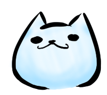

# Kirby

A Nintendo Character

- - -

### about

Kirby (カービィ Kābī?) is a fictional character and the titular protagonist of the Kirby series of video games owned by Nintendo and HAL Laboratory. As one of Nintendo's most famous and familiar icons, Kirby's round appearance and ability to copy his foes' powers has made him a well known figure in video games, consistently ranked as one of the most iconic video game characters. 

### Links

 * [安順電腦班](https://hello123tw.acsite.org/)
 * [How did your favourite Nintendo characters get their names?](http://www.officialnintendomagazine.co.uk/42153/how-did-mario-get-his-name-and-the-origins-of-your-favourite-nintendo-stars/?page=6)
 * [Why is Kirby always angry in the US? Nintendo explains](http://www.gamespot.com/articles/why-is-kirby-always-angry-in-the-us-nintendo-explains/1100-6419263/)

- - -
